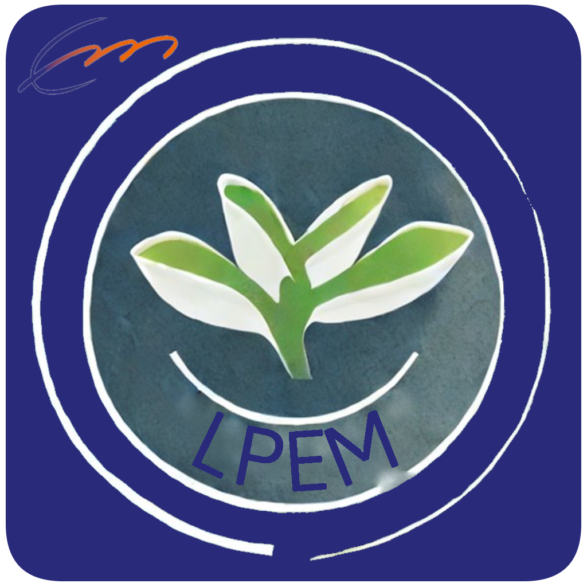
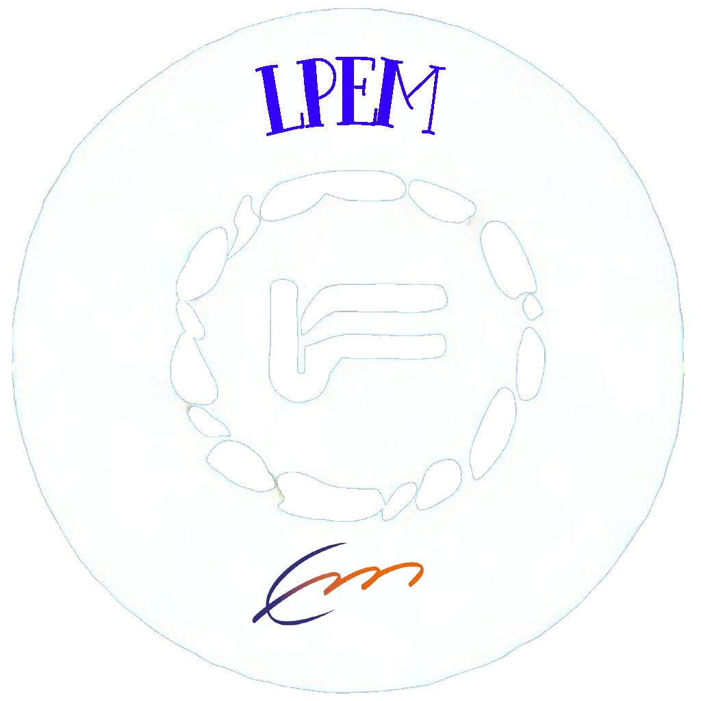

        

            &nbsp;
        

        <table align="center">
            <tr>
                <td></td>
                <td><h2 >©2023</h2></td>
                

                    
                    
                    
                    
                

            </tr>
        </table>
    

# Alle Documente

- [www](code/www)
  - [Website](code/www/nuxt)
  - [API](code/www/api)
- [application](code/application)
  - [ESP Display](code/esp32_display)
  - [ESP Sensor](code/esp32_sensors)

# Richtlinien

# Plexiglas
- max. Größe 600x400 m^2
- transparent- oder Milchglas
- 3mm oder 5mm
# Hauptversorgung
- Netzteil
- MAX 12v
- PV-Anlage + Speicher
- Über PV-Anlage soll die Beleuchtung versorgt werden
# Arduino oder Raspberry PI

## Sensoren
- Temperatur
- Luftfeuchtigkeit

## Aktoren
- Lcd 16x2
- Beleuchtung
- Belüftung

## Zusatz Funktionen
- Raspberry Pi für Visualisierung auf einem lcd angeschlossen

# Dossier
1. Funktionsbeschreibung
    - Text
    - Animation
2. Materialliste
    - Preis Liste in Excel
3. Elektrik
    - Schaltplan
    - Synoptik
    - Programm (code vom Arduino)
4. Gehäuse
    - Fusion Model erstellen vom Gesamtprojekt
    - 3D Model Animation (in ppt)

# Links
## Geschäfte
- [AZ-Delivery.de](https://www.az-delivery.de/)
- [Reichelt.de](https://www.reichelt.de/)
- [ELV.com](https://www.elv.com/)
- [Lemo-Solar.de](https://www.lemo-solar.de/)
- [Electronic-Shop.lu](https://www.electronic-shop.lu/)
- [Conrad.de](https://www.conrad.de/)

## Anderes
- [link 1](http://projects.htl-klu.at/Projekt_1617/pr7abeli35331/Internet/details.html)
- [link 2](https://randomnerdtutorials.com/esp32-http-get-post-arduino/)
- [link 3](https://randomnerdtutorials.com/getting-started-node-red-dashboard/)
- [link 4](https://www.instructables.com/Automated-Greenhouse/)
- [color piker](http://www.barth-dev.de/online/rgb565-color-picker/)
- [Github 1](https://github.com/jiteshsaini/rest-api-examples)

## Videos
- [video 1](https://www.youtube.com/watch?v=1J8-cBR0R3M)

## Essential
- [Converter BMP into C](https://javl.github.io/image2cpp/)

# License
[License Terms](LICENSE)

       Copyright 2023 the original author or authors.

   Licensed under the Apache License, Version 2.0 (the "License");
   you may not use this file except in compliance with the License.
   You may obtain a copy of the License at

       http://www.apache.org/licenses/LICENSE-2.0

   Unless required by applicable law or agreed to in writing, software
   distributed under the License is distributed on an "AS IS" BASIS,
   WITHOUT WARRANTIES OR CONDITIONS OF ANY KIND, either express or implied.
   See the License for the specific language governing permissions and
   limitations under the License.
